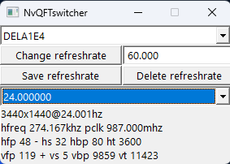

# NvQFTswitcher
Simple proof of concept app which enables fast refresh rate switching via quick frame transport.

* Nvidia gpu required
* Suitible for custom fixed refreshrates on vrr capable displays.
* Can allow you to use fixed refreshrates that your monitor is not normally capable of displaying.
* qft modes can help reduce crosstalk when using low refreshrates on high refreshrate capable monitors with backlight strobing.
* Start the app with your monitor at its maximum refresh rate. This will establish the base video timings from which your custom refresh rates will be derived.
* ALT + SHIFT + R to recover from a bad modeswitch.
* Basic support for saving frequently used refresh rates per monitor.

